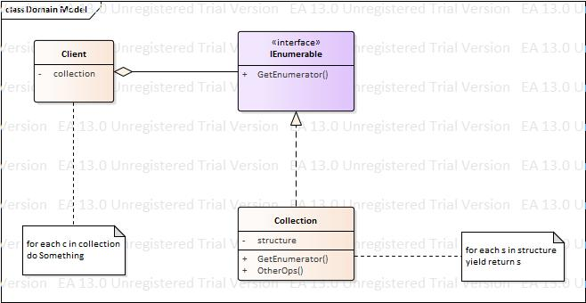

# LearningViaCS
## C# Design Pattern  
|[Structural Design Patterns](https://www.codeproject.com/articles/438922/design-patterns-2-of-3-structural-design-patterns)|[Creational Design Pattern](https://www.codeproject.com/Articles/430590/Design-Patterns-of-Creational-Design-Patterns)|[Behavioral Design Pattern]()|
|-|-|-|
|[Decorator](https://www.processon.com/view/link/58f23385e4b0f563a7c56beb)|[Prototype](https://www.processon.com/view/link/58f8aeebe4b04aba15183c21)|Strategy|
|[Proxy](https://www.processon.com/view/link/58f234c7e4b0cb4162b696aa)|[FactoryMethod](http://www.processon.com/view/link/58fa1cb4e4b0f645b01fe05b)|State|
|[Bridge](https://www.processon.com/view/link/58f234f4e4b0dfe7d6bab83b)|Singleton|TemplateMethod|
|[Composite](https://www.processon.com/view/link/58f36e0fe4b04081421137f3)|AbstractFactory|ChainOfResponsibility|
|[Flyweight](https://www.processon.com/view/link/58f4b732e4b02e95ec50d682)|Builder|Command|
|[Adapter](https://www.processon.com/view/link/58f61ca8e4b0c9097c8d45d0)||Iterator|
|[Facade](https://www.processon.com/view/link/58f76dfbe4b0dfe7d6eb5553)||Mediator|
|||Observer|
|||Visitor|
|||Interpreter|
|||Memento|
### Decorator

### Proxy

### Bridge

### Composite

### Flyweight

### Adapter

### Facade

### Prototype

### FactoryMethod

### Singleton

### AbstractFactory

### Builder

### Strategy

### State

### TemplateMethod

### ChainOfResponsibility

### Command

### Iterator

### Mediator

### Observer

### Visitor
b
### Interpreter

### Memento
